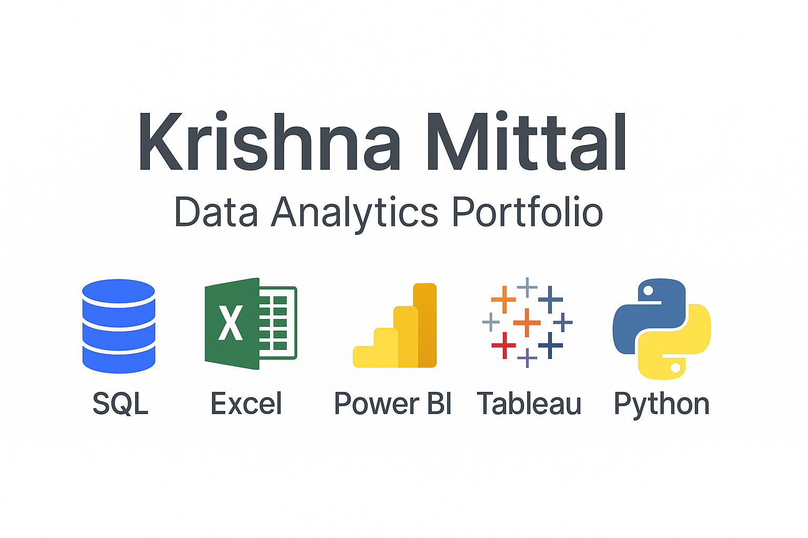

# 📂 Data Analytics Portfolio – Krishna Mittal

  

Welcome to my Data Analytics Portfolio 👋
This repository highlights my end-to-end projects using SQL, Excel, Power BI, Tableau, and Python.
Each project demonstrates my ability to clean, analyze, and visualize data to deliver actionable business insights.

## 📊 Projects
### 🛒 Blinkit Sales Analysis (Power BI)
- Designed and deployed an interactive Power BI dashboard analyzing 8,500+ Blinkit grocery sales records.
- Delivered insights on store performance, product categories, and customer preferences to support decision-making.
🔗 [Live Power BI Dashboard](https://app.powerbi.com/view?r=eyJrIjoiMDg1N2E4ZDEtNzZjMi00ZTQyLWFmMDEtZTdhYWVmYmUzODU5IiwidCI6ImVkNGI1YWIzLWM0MzctNGNiMi05NzczLTYzZDdlMTc0OWVhNyJ9)
🔗 [View Project Files](./Blinkit%20Data%20Analysis/Readme.md)

### 🏦 Bank Loan Data Analysis (SQL + Power BI + Tableau)
- Conducted a comprehensive loan performance analysis using SQL, Excel, and BI tools.
- Built dashboards to monitor loan default rates, repayment trends, and borrower risk categories.

Published on Tableau Public for interactive exploration.
🔗 [Live Tableau Dashboard](https://public.tableau.com/app/profile/krishna.mittal6200/viz/BankLoanDataAnalysis_17592567907460/SUMMARY)
🔗 [View Project Files](./Bank%20Loan%20Data%20Analytics/Readme.md)

## 🛠️ Skills & Tools
- **Languages**: SQL, Python
- **Data Handling**: Excel, Pandas
- **Visualization**: Power BI, Tableau
- **Analytics**: Business KPIs, Data Cleaning, Dashboard Building, Insights Generation

## 📬 Contact
- **Name**: Krishna Mittal
- **Email**: mittalkrishna58@gmail.com
- **LinkedIn**: [My Profile](https://www.linkedin.com/in/krishna-mittal-88382317a/)
- **GitHub**: [Github](https://github.com/krishnamittal2003)